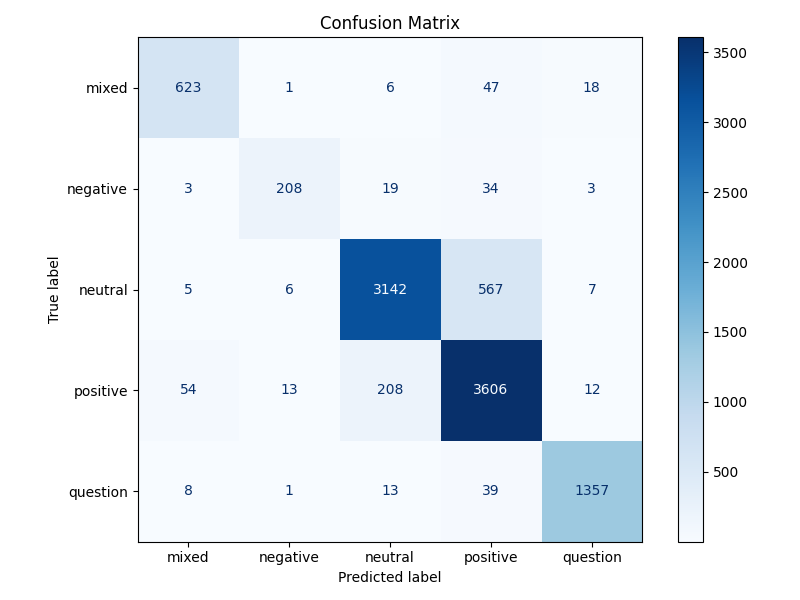
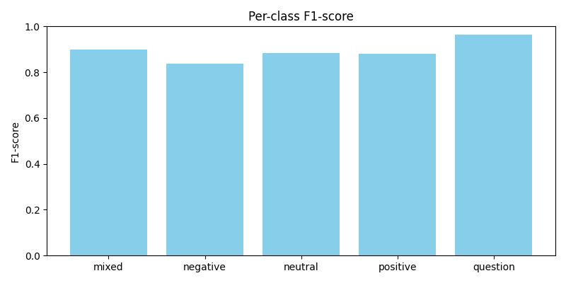
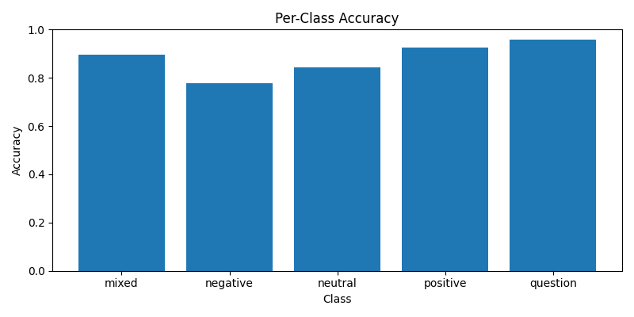
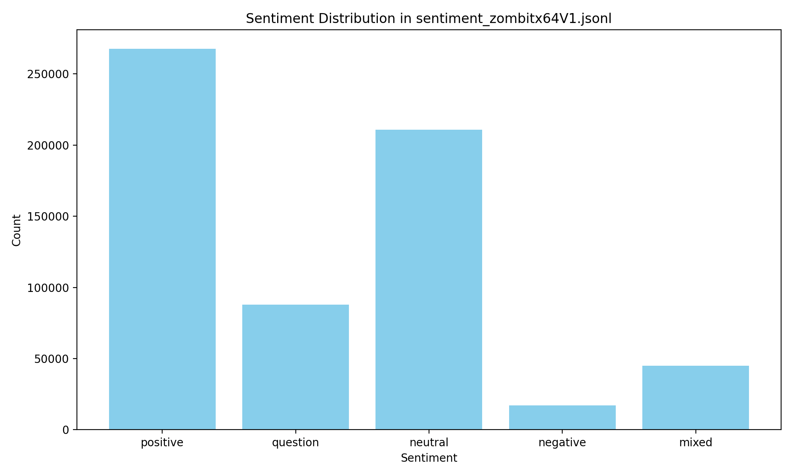

# Thai Text Sentiment Classification

A deep learning project for sentiment analysis of Thai text using Hugging Face datasets and Keras LSTM.

---

## 🚀 Features
- **Thai Sentiment Classification**: Classifies text as `positive`, `negative`, or `neutral`.
- **Pretrained Tokenizer**: Uses Hugging Face's Thai tokenizer.
- **LSTM Model**: Deep learning with Keras for sequence modeling.
- **Ready for Hugging Face Hub**: Scripts to upload model and assets.

---

## 📦 Requirements
- Python 3.8+
- tensorflow
- transformers
- datasets
- numpy
- scikit-learn
- huggingface_hub

Install all dependencies:
```bash
pip install -r requirements.txt
```

---

## 🏗️ Training
Train the model with:
```bash
python thai_text_classifier.py
```
- Uses the Wisesight-Sentiment-Thai dataset from Hugging Face
- Trains on the first 610,000 samples for speed (edit in code for full dataset)
- Model, tokenizer, and label encoder are saved after training

---

## 🧪 Testing
Test the model with sample sentences:
```bash
python test_sentiment.py
```
- Shows predicted sentiment and confidence for each sample
- You can edit `test_sentiment.py` to test your own sentences

---

## ☁️ Upload Model to Hugging Face Hub
1. Install the Hugging Face Hub client:
   ```bash
   pip install huggingface_hub
   ```
2. Edit `upload_to_hf.py` and set your `HF_TOKEN` and `REPO_ID` (see comments in the file).
3. Run:
   ```bash
   python upload_to_hf.py
   ```

---

## 📁 Files
- `thai_text_classifier.py` — Training script
- `test_sentiment.py` — Script for testing the model
- `upload_to_hf.py` — Script to upload model/tokenizer/label encoder to Hugging Face Hub
- `requirements.txt` — Python dependencies
- `.gitignore` — Ignore unnecessary files

---

## ✨ Example Output
```
Test 1: ร้านนี้อร่อยมาก ชอบมากเลย
Predicted sentiment: positive (confidence: 0.99)
Test 2: แย่มาก บริการแย่ อาหารไม่อร่อย
Predicted sentiment: negative (confidence: 0.99)
Test 3: ปกติ ไม่ดีไม่แย่
Predicted sentiment: neutral (confidence: 0.83)
```

---

 
## 📊 Evaluation Results

หลังจากเทรนและประเมินโมเดล จะได้กราฟผลลัพธ์ดังนี้ (ไฟล์ในโฟลเดอร์ `assets`):

 
### Confusion Matrix

*แสดงจำนวนตัวอย่างที่โมเดลทำนายถูกและผิดในแต่ละคลาส*  

 
### Per-class F1 Score

*เปรียบเทียบค่า F1-score ของแต่ละคลาส sentiment เพื่อวัดประสิทธิภาพ*  

 
### Per-class Accuracy

*แสดงความแม่นยำ (accuracy) ในแต่ละคลาส แยกตาม positive, negative, neutral*  

 
### Sentiment Distribution

*แสดงการกระจายของ label ในชุดข้อมูล validation/test ว่าเป็น positive, negative, neutral อัตราส่วนเท่าใด*  

---

## 📜 License
MIT

---

## 🤗 Credits
- [Wisesight-Sentiment-Thai Dataset](https://huggingface.co/datasets/ZombitX64/Wisesight-Sentiment-Thai)
- [Hugging Face Transformers](https://huggingface.co/transformers/)
- [TensorFlow/Keras](https://www.tensorflow.org/)